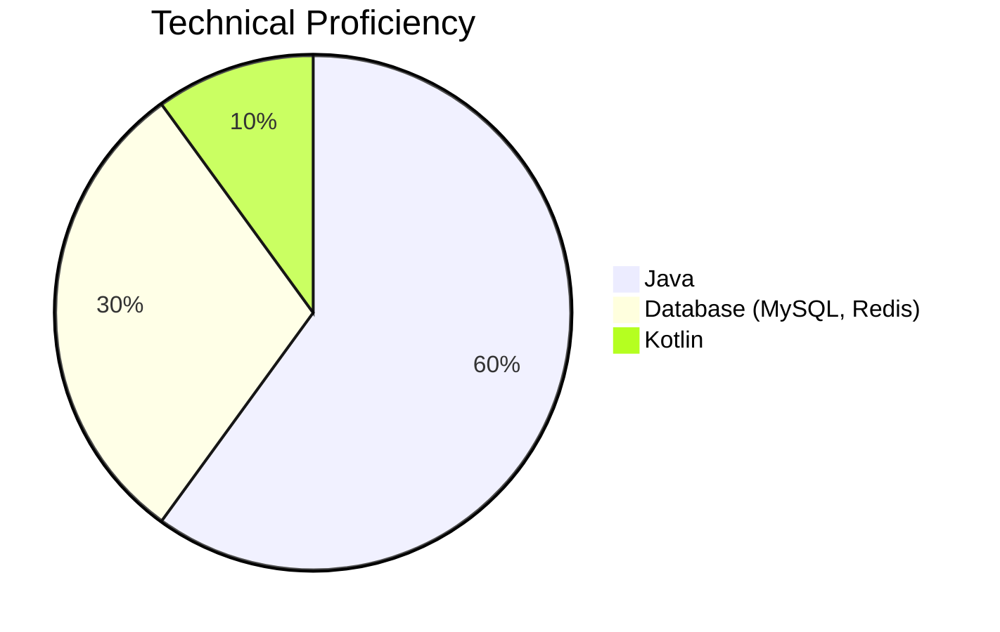

# Hi there 👋  
안녕하세요, **조성신**입니다.  

저는 외식업계에서 4년, 스타트업 운영팀에서 1년을 경험하며 고객 서비스, 팀워크, 프로젝트 관리, 문제 해결 능력을 탄탄히 키웠습니다. 
서비스를 제공하고 운영하는 것에서 나아가, 직접 개발하고 개선하는 사람이 되고 싶어 개발자로 전향했습니다.

현재는 JPA와 QueryDSL을 활용하여 백엔드 개발을 진행 중이며, 중복을 최소화하고 명확하고 간결한 코드 작성을 중요한 가치로 생각합니다. 단순히 기능을 구현하는 것을 넘어, 사용자, 운영, 기획, 개발의 여러 관점을 고려한 실용적이고 효율적인 솔루션을 만드는 것이 저의 목표입니다.

과거 서비스 운영 경험은 복잡한 문제를 심도 있게 분석하고 해결하는 데 큰 자산이 되고 있습니다. 특히, 변화하는 환경에 유연하게 적응하며, 기획자, 운영팀, 개발자 간의 원활한 커뮤니케이션으로 협업을 효과적으로 이끌어낼 수 있는 강점을 가지고 있습니다.

이러한 배경과 역량을 바탕으로, 더 나은 서비스를 개발하고 실질적인 가치를 창출하는 개발자로 지속적으로 성장하고자 합니다.

---

# 👨‍💻 About Me  
✔ **Contact**  
- **Email**: sungsin1030@gmail.com  
- **Resume (Web)**: [Web Resume](https://devsung.github.io)

✔ **What I Value**  
- **문제 해결 중심의 사고**: 비즈니스와 기술 문제를 효과적으로 해결할 수 있는 최적의 솔루션을 설계하는 데 주력하고 있습니다.  
- **효율적인 협업**: 다양한 팀원(기획, 디자이너, QA 등)과 원활히 소통하며 성과를 이끌어내는 데 강점을 가지고 있습니다.  
- **성장하는 기술 역량**: 트렌드에 발맞춰 **Kotlin**, **Redis**, **MSA** 등의 기술을 적극적으로 습득하고 적용하고 있습니다.

# 💪 Skills  

## ✔ Platforms & Languages  

  
  
  
  
  
  
  
  
  
  
  

  

## ▶ Technical Proficiency Chart
아래는 보유 기술에서 각각의 숙련도를 시각화한 차트입니다:

✔ **Java**  
- 가장 익숙하고 주력으로 사용하는 언어로 백엔드 아키텍처 설계와 REST API 구현에 주로 활용.  
- 관련 경험: 3년 이상.  

✔ **Database (MySQL, Redis)**  
- 데이터 최적화, 복잡한 쿼리 작성에 강점을 보이며 Redis 캐싱 기술도 사용.  
- 관련 경험: 3년 이상.

✔ **Kotlin**  
- JVM 환경 내에서 활용 가능한 언어로 점진적 학습 중이며, 기존 Java 코드를 확장하는 데 사용.  
- 관련 경험: 1년 미만.  

---

 

## ✔ Tools  

  
  
  
  
  
  

---

# 💡 Future Goals  
- **클라우드 기반 MSA 구조 학습**: AWS, Kubernetes를 심화적으로 학습 및 적용.  
- **코드 품질 강화**: `JUnit`, `Mockito` 등을 통해 테스트 커버리지를 높이고 코드 안정성을 강화.  
- **성능 최적화**: 대규모 트래픽에 대한 효율적인 처리 및 데이터베이스 성능 개선.  
